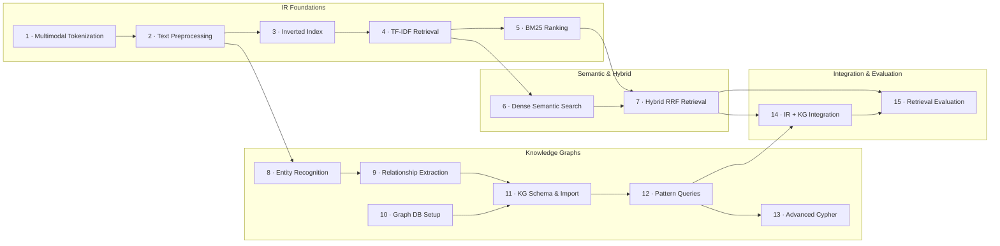

<div align="center">

```
┌─────────────────────────────────────────────────────────────────────────────┐
│                                                                             │
│      ██╗  ██╗  ██╗  ██████╗    █████╗                                      │
│      ██║ ██╔╝  ██║  ██╔══██╗  ██╔══██╗                                     │
│      █████╔╝   ██║  ██████╔╝  ███████║                                     │
│      ██╔═██╗   ██║  ██╔══██╗  ██╔══██║                                     │
│      ██║  ██╗  ██║  ██║  ██║  ██║  ██║                                     │
│      ╚═╝  ╚═╝  ╚═╝  ╚═╝  ╚═╝  ╚═╝  ╚═╝                                    │
│                                                                             │
│            Knowledge  ·  Information  ·  Retrieval  ·  Arena                │
│                                                                             │
│        A Web-Based Virtual Laboratory for Information Retrieval             │
│              Submitted to GOLC 2027 · CS-IR-301 v2027.1                    │
│                                                                             │
└─────────────────────────────────────────────────────────────────────────────┘
```

<p>
  
  
  
  
  
  
  
</p>

</div>

---

## What is KIRA?

KIRA is a **fully browser-based virtual laboratory** that teaches the theory, implementation, and evaluation of modern Information Retrieval systems — from classical inverted indexes to GraphRAG — through 15 sequenced, interactive experiments.

It is not a slideshow. It is not a PDF. Every experiment gives students a live simulation workbench, an assessable quiz, a verifiable certificate, and a downloadable lab report — all persisted to the cloud through Firebase Firestore.

> Built with React 19 + Vite 6, deployed with zero backend servers. Firebase handles authentication and persistence; the browser handles the rest.

---

## The Problem It Solves

Information Retrieval is taught in almost every CS curriculum, yet practical hands-on access is uneven. Setting up FAISS, graph databases, or dense bi-encoders locally requires non-trivial infrastructure that many institutions cannot guarantee. Students often read about BM25 or GraphRAG without ever executing a query, tuning a parameter, or watching a traversal animate in real time.

KIRA collapses that gap. A student needs only a browser and an account. Every algorithm runs inside the client, powered by carefully engineered JavaScript simulations that preserve pedagogic fidelity.

---

## Curriculum at a Glance

The 15 experiments are divided into four interconnected tracks. The dependency graph below is the canonical learning sequence:



---

<details>
<summary><strong>Experiment Catalog — Full Details</strong></summary>

<br>

### Track 1 — IR Foundations

| # | Title | Key Concepts | Lab Tech |
|---|-------|-------------|----------|
| 1 | **Multimodal Tokenization** | ViT patches, audio frames, video keyframes, cross-modal tokens | HTML5 Canvas, Web Audio API, React |
| 2 | **Text Preprocessing & Normalization** | Porter stemmer, WordNet lemmatizer, stop-word filtering, case folding | NLTK, spaCy, regex pipeline |
| 3 | **Inverted Index Construction** | Postings lists, positional indexing, two-pointer merge, Zipf's Law | Custom in-browser index engine |
| 4 | **TF-IDF Document Retrieval** | Term/IDF weighting, cosine similarity, vector space model | NumPy, Scikit-learn simulation |
| 5 | **BM25 Document Ranking** | Okapi BM25, k₁ saturation, b length normalization, probabilistic IR | BM25 scoring engine |

### Track 2 — Semantic & Hybrid Search

| # | Title | Key Concepts | Lab Tech |
|---|-------|-------------|----------|
| 6 | **Dense Embedding-Based Semantic Search** | Bi-encoders, sentence transformers, ANN (FAISS/HNSW), cosine similarity | @xenova/transformers (in-browser) |
| 7 | **Hybrid Keyword + Semantic Retrieval** | Reciprocal Rank Fusion (RRF), score normalization, cross-encoder re-ranking | Parallel BM25 + dense pipeline |

### Track 3 — Knowledge Graphs

| # | Title | Key Concepts | Lab Tech |
|---|-------|-------------|----------|
| 8 | **Identify Graph Entities** | Named Entity Recognition, BIO tagging, entity resolution, domain ontology | spaCy + transformer NER |
| 9 | **Relationship Extraction from Text** | Triple extraction (S-P-O), dependency parsing, OpenIE, relation classification | Stanford OpenIE, DSPy |
| 10 | **Create & Manage a Graph Database** | Nodes/edges CRUD, graph modeling, constraints, indexes | Graph DB + Cypher |
| 11 | **KG Schema Design & Data Import** | Ontology mapping, LOAD CSV, APOC batch ingestion, schema diagrams | APOC Library, Pandas |
| 12 | **Pattern-Based Graph Querying** | MATCH/RETURN patterns, WHERE filters, multi-hop traversals, aggregations | **In-browser graph query engine** |
| 13 | **Advanced Cypher & Pattern Matching** | Variable-length paths, shortestPath(), GDS PageRank/Louvain, PROFILE | Knowledge Graph Data Science |

### Track 4 — Integration & Evaluation

| # | Title | Key Concepts | Lab Tech |
|---|-------|-------------|----------|
| 14 | **IR + Knowledge Graph Integration** | GraphRAG, entity linking, sub-graph expansion, knowledge-enhanced search | LangChain / LlamaIndex + KG DB |
| 15 | **Evaluation of Retrieval Systems ★** | P@k, R@k, F1, MRR, confusion matrix, BM25 vs Dense vs Hybrid vs GraphRAG | **Full in-browser live simulation** |

> **★ Experiment 15** is the capstone — a fully self-contained virtual lab with dynamic query evaluation, live metric charts, a 10-question assessment, and certificate + report generation.

</details>

---

## The Virtual Lab — Experiment 15 Deep Dive

Experiment 15 is the most technically sophisticated component in the codebase. It implements every piece of an IR evaluation pipeline entirely in JavaScript.

### What it does

A student types any free-text query. The system simultaneously runs four retrieval strategies against a 14-document corpus and computes P@k, R@k, F₁, and MRR — all live, in the browser, with animated charts.

### How the scoring pipeline works

```
User Query
    │
    ▼
tokenize() — lowercase, strip punctuation, split
    │
    ├──────────────────────┐
    ▼                      ▼
scoreBM25()           scoreDense()
k₁=1.2, b=0.75        term match +
title weight ×3       SEMANTIC_CLUSTERS
IDF approximated      synonym expansion
    │                      │
    └──────────┬───────────┘
               │
    ┌──────────┴──────────┐
    ▼                     ▼
scoreGraphRAG()      RRF fusion
1-hop neighbor       1/(60+rank_bm25)
score propagation    + 1/(60+rank_dense)
    │                     │
    └──────────┬───────────┘
               ▼
    Ground-Truth Relevance
    dynamic threshold ≥ 20%
    of max combined score
               │
               ▼
    computeMetrics(systemId, k)
    P@k = relevant ∩ retrieved_k / k
    R@k = relevant ∩ retrieved_k / |relevant|
    F₁  = 2·P·R / (P+R)
    RR  = 1 / first_relevant_rank
               │
               ▼
    computeCurve() — sweeps k = 1..10
    getComparisonTable() — 4×4 metric matrix
    computeMRR() — across query scenarios
```

### Key source files for Exp 15

| File | Role |
|------|------|
| `src/data/labData.js` | 14-document corpus, scoring engines, metric formulas, 10-question quiz bank |
| `src/experiments/exp15/index.jsx` | Tab router + Firebase sync on quiz completion |
| `…/components/TheorySection.jsx` | MathJax-rendered metric definitions (P@k, R@k, F₁, MRR) |
| `…/components/LabSection.jsx` | Live query input, 4-system ranked result panels, P/R/F1/MRR charts |
| `…/components/QuizSection.jsx` | 10-question adaptive assessment |
| `…/components/CertificateSection.jsx` | Printable academic certificate via html2canvas + jsPDF |
| `…/components/ReportSection.jsx` | Formatted evaluation report with benchmark summary |

---

## Experiment 12 — Knowledge Graph Pattern Workbench

Experiment 12 implements a full graph query playground **without any external database**. The entire graph engine runs in the browser.

| Query Mode | What it generates |
|------------|-------------------|
| **Node Lookup** | `MATCH (n:Label) WHERE n.prop > val RETURN n` — filter by label, property, operator |
| **1-Hop Traversal** | Direct neighbor traversal by relationship type and edge direction |
| **Multi-Hop Paths** | BFS up to N hops, target label filtering — surfaces indirect connections |
| **Raw Pattern Query** | Cypher-like patterns from preset library or custom free-text input |

Results export to CSV or JSON. Traversal steps animate in real time on a zoomable SVG canvas. Students can also construct their own graphs in **Graph Studio** mode with full node/edge CRUD and preset datasets (Movie Graph · CS Pioneers · blank canvas).

---

## Architecture

```
Browser (Client Only)
─────────────────────────────────────────────────────────────────
 AuthProvider (Context)
     │
     ├── authService.js     progressService.js     likeService.js
     │        │                    │                    │
     │        └──────────── Firebase / localStorage ────┘
     │
 App.jsx — hash router (#login #exp1–15 #profile)
     │
     ├── [unauthenticated] → AuthPage (Email/Password · Google OAuth)
     │
     └── [authenticated]
             ├── LandingPage.jsx
             │     ├── CurriculumGraph (zoomable SVG dependency graph)
             │     ├── ExperimentModal (detail drawer: topics, prereqs, tech)
             │     └── Card grid (search · track filter · like buttons)
             │
             ├── ExperimentTemplate.jsx (Exp 1–14)
             │     Theory · Lab · Assessment · Report
             │
             ├── Experiment15/index.jsx (capstone, fully custom)
             │     Theory · Visual Lab · Quiz · Certificate · Report
             │
             └── StudentProfileModal (global, hash #profile)
                   Overview · Certificates · Lab Reports · Academic Details

─────────────────────────────────────────────────────────────────
Firebase (Google Cloud)
  Authentication — Email/Password + Google OAuth
  Firestore — user profiles, progress, certificates, reports, likes
─────────────────────────────────────────────────────────────────
```

---

## Firebase Integration

The platform operates in two modes — switching is automatic based on the presence of `VITE_FIREBASE_*` environment variables.

| Mode | Auth | Progress | Certificates | Likes |
|------|------|----------|-------------|-------|
| **Live Firebase** | Firebase Auth (Email + Google OAuth) | Firestore `users/{uid}/progress/current` | Firestore `users/{uid}/certificates/exp_{n}` | Firestore `experiment_likes/{expId}` |
| **Local Fallback** | `localStorage` user store | `localStorage` with `ir_lab_progress_` prefix | `localStorage` with `ir_lab_certificates_` prefix | `localStorage` cache + baseline counts |

### Firestore data model

```
Firestore
├── users/
│   └── {uid}/
│       ├── (document)              ← student profile
│       │    firstName, lastName, displayName, username,
│       │    studentId, email, institution, provider, createdAt
│       ├── progress/
│       │   └── current             ← completedExperiments[], quizScores{}, lastActiveExp
│       ├── certificates/
│       │   └── exp_{n}             ← grade, score, pct, certificateId, issuedAt
│       ├── reports/
│       │   └── exp_{n}             ← benchmark summary, submittedAt
│       └── likes/
│           └── {expId}             ← likedAt, experimentKey
└── experiment_likes/
    └── {expId}/
        ├── (document)              ← count (atomic increment), lastUpdated
        └── user_likes/
            └── {uid}               ← uid, displayName, likedAt
```

### Security model

```
// users/{userId} — each student reads/writes only their own document tree
match /users/{userId} {
  allow read, write: if request.auth.uid == userId;
}

// experiment_likes — counts are publicly readable; writes require auth
match /experiment_likes/{expId} {
  allow read: if true;
  allow write: if request.auth != null;
}
```

### Rate limiting & debouncing

Both `progressService` and `likeService` apply client-side throttling: max 20 Firestore writes per minute, with 800ms debounce on progress writes and 600ms on like toggles. State is updated optimistically in `localStorage` first, then synced to Firestore asynchronously.

---

## Project Structure

```
GOLC2027_Exp/
├── index.html                         # Vite HTML entry + MathJax CDN
├── vite.config.js                     # @vitejs/plugin-react + @tailwindcss/vite
├── package.json
├── firestore.rules                    # Production Firestore security rules
├── .env                               # Firebase credentials (gitignored)
│
└── src/
    ├── main.jsx                       # React DOM root mount
    ├── App.jsx                        # Hash router + auth guard + profile modal
    ├── index.css                      # Tailwind v4 + glass-morphism utilities
    │
    ├── context/
    │   └── AuthContext.jsx            # AuthProvider: user, progress, certs, reports
    │
    ├── services/
    │   ├── firebase.js                # Firebase init + isFirebaseConfigured() guard
    │   ├── authService.js             # Email/password, Google OAuth, username lookup
    │   ├── progressService.js         # Experiment completion, quiz scores, debounced sync
    │   └── likeService.js             # Optimistic like toggle, Firestore atomic increments
    │
    ├── data/
    │   ├── experimentsData.js         # 15-experiment dataset + GRAPH_EDGES + tracks
    │   ├── labData.js                 # Exp 15: corpus, scoring engines, quiz bank
    │   └── contributorsData.js        # Student contributor directory
    │
    ├── components/
    │   ├── LandingPage.jsx            # Dashboard: graph/card views, search, modal
    │   ├── CurriculumGraph.jsx        # Interactive SVG dependency graph (zoom, hover)
    │   ├── ExperimentModal.jsx        # Detail drawer: prereqs, topics, tech stack
    │   ├── profile/
    │   │   └── StudentProfileModal.jsx  # 4-tab profile modal
    │   └── common/
    │       ├── ExperimentNavbar.jsx   # Sticky tab bar with quiz score badge
    │       ├── ExperimentLikeButton.jsx
    │       ├── UnifiedQuizSection.jsx   # Shared quiz (Exp 1–14)
    │       ├── UnifiedCertificateSection.jsx
    │       ├── UnifiedReportSection.jsx
    │       ├── UserDropdown.jsx       # Avatar menu + profile link + sign-out
    │       └── AmbientBackground.jsx
    │
    ├── experiments/
    │   ├── index.js                   # EXPERIMENT_COMPONENTS registry {1..15}
    │   ├── ExperimentTemplate.jsx     # Default scaffold (Theory/Lab/Quiz/Report)
    │   ├── exp1/ … exp14/             # Individual experiment modules
    │   └── exp15/                     # Capstone — fully custom implementation
    │       ├── index.jsx              # Tab router + Firebase sync
    │       ├── components/            # TheorySection, LabSection, QuizSection,
    │       │                          # CertificateSection, ReportSection
    │       └── data/labData.js
    │
    └── pages/
        └── AuthPage.jsx               # Login / Register (email + Google OAuth)
```

---

## User Flow

```
[Unauthenticated visitor]
        │
        ▼
   AuthPage
   Email/Password  OR  Google OAuth
        │
        ▼ success
[AuthContext] syncs from Firestore:
   progress · certificates · reports · like counts
        │
        ▼
   LandingPage
   ├─ CurriculumGraph (SVG, zoom, hover → prereq highlight, click → modal)
   └─ Card Grid  (search by title/topic/tech · filter by track · like button)
        │
        ▼ Launch Experiment #N
   ExperimentTemplate  OR  Experiment15 (capstone)
   ├─ Theory      — MathJax formulas, objectives, key topics
   ├─ Lab         — interactive simulation workbench
   ├─ Assessment  — auto-graded quiz (score persisted to Firestore)
   ├─ Certificate — printable credential (html2canvas + jsPDF)
   └─ Report      — benchmark evaluation summary
        │
        ▼ Quiz completed
   recordQuizScore()     → Firestore users/{uid}/progress/current
   recordCertificate()   → Firestore users/{uid}/certificates/exp_15
   recordReport()        → Firestore users/{uid}/reports/exp_15
        │
        ▼
   StudentProfileModal (#profile)
   Overview · Certificates · Lab Reports · Academic Details
```

---

## Student Profile Modal

The global `StudentProfileModal` (accessible from any page via the user dropdown) aggregates all persisted data into four tabs:

| Tab | Contents |
|-----|----------|
| **Overview & Progress** | Completed labs (X / 15), curriculum %, 4-track mastery matrix, direct Exp 15 launch |
| **Certificates Issued** | Grade badge (A+ / A / B / C), score %, verification ID, issue date, Print Certificate action |
| **Lab Reports** | MRR, Precision@10, Recall@10, F₁ benchmark summary per completed experiment |
| **Academic Details** | Editable roll number and institution name — synced to Firestore via `updateUserProfile()` |

---

## Tech Stack

| Layer | Technology | Version | Purpose |
|-------|-----------|---------|---------|
| UI Framework | React | 19 | Component model, concurrent rendering |
| Build Tool | Vite | 6 | Sub-second HMR, ESM bundling |
| Styling | Tailwind CSS | v4 | Utility classes via @tailwindcss/vite |
| Animations | Framer Motion | 13 | Page transitions, micro-animations |
| Icons | Lucide React | latest | Consistent iconography |
| Auth & DB | Firebase | 12 | Authentication + Cloud Firestore |
| PDF Export | jsPDF + html2canvas | 4 / 1.4 | Certificate PDF generation |
| Math Rendering | MathJax | CDN | LaTeX metric formulae |
| In-browser NLP | @xenova/transformers | 2.17 | Client-side transformer inference |
| Confetti | canvas-confetti | 1.9 | Quiz completion celebration |

---

## Setup & Running

### Prerequisites

- Node.js ≥ 18
- npm ≥ 9

### 1 — Install & start

```bash
git clone https://github.com/<your-org>/GOLC2027_Exp.git
cd GOLC2027_Exp
npm install
npm run dev
```

Open `http://localhost:5173`. The platform runs immediately in **Local Fallback mode** — all data is stored in `localStorage`. No Firebase credentials are required for development.

### 2 — Connect Firebase (optional, for live persistence)

1. Create a Firebase project at [console.firebase.google.com](https://console.firebase.google.com)
2. Enable **Authentication** → Email/Password and Google providers
3. Create a **Firestore Database** (recommended region: `asia-south1` or `us-central1`)
4. In the **Rules** tab, paste the contents of `firestore.rules`
5. Register a web app, copy credentials, create `.env` in the project root:

```env
VITE_FIREBASE_API_KEY=AIzaSy...
VITE_FIREBASE_AUTH_DOMAIN=your-project.firebaseapp.com
VITE_FIREBASE_PROJECT_ID=your-project-id
VITE_FIREBASE_STORAGE_BUCKET=your-project.appspot.com
VITE_FIREBASE_MESSAGING_SENDER_ID=123456789012
VITE_FIREBASE_APP_ID=1:123456789012:web:abcdef123456
```

6. Restart `npm run dev`. The console will print:
   ```
   [Firebase] Connected to live Firebase project: your-project-id
   ```

### 3 — Production build

```bash
npm run build     # output to dist/
npm run preview   # serve built bundle locally
```

---

## URL / Hash Routing

The app uses a lightweight hash-based SPA router — no external routing library required.

| Hash | View |
|------|------|
| *(none)* | Landing page (auth-gated) |
| `#login` / `#signin` / `#auth` | Login form |
| `#register` / `#signup` | Registration form |
| `#exp1` … `#exp15` | Launch experiment directly |
| `#profile` | Open Student Profile Modal |

---

## Current Scope & Limitations

> [!NOTE]
> KIRA is an academic virtual laboratory for GOLC 2027. The following boundaries are intentional design decisions.

- **Simulated algorithms** — BM25, dense, RRF, and GraphRAG scoring functions are JavaScript reimplementations optimized for pedagogy. Results are internally consistent but are not benchmarked against a production search index.
- **14-document corpus** — Experiment 15 operates on a curated academic corpus. It demonstrates evaluation mechanics, not exhaustive retrieval coverage.
- **No server-side execution** — Experiments referencing Python toolchains (spaCy, FAISS, HuggingFace) describe the production technology; in-browser simulations approximate those behaviours.
- **Per-user isolation** — Firestore rules enforce strict UID-scoped access. There is no cohort dashboard or instructor view.
- **In-memory graph engine** — Experiment 12's query engine runs entirely in-memory. It does not connect to a production Neo4j or ArangoDB instance.

---

## Roadmap

<details>
<summary>Planned directions (not committed timelines)</summary>

- **Instructor dashboard** — cohort progress overview, aggregate quiz analytics, grade export
- **Real corpus expansion** — connect a live inverted index or vector store for Experiments 4–7
- **In-browser FAISS via WASM** — replace semantic simulation with actual ANN using WebAssembly
- **Adaptive quiz difficulty** — adjust question selection based on cumulative performance
- **Multi-language UI** — i18n support for regional cohorts
- **LMS integration** — LTI 1.3 connector for embedding KIRA in Moodle or Canvas
- **Experiment authoring SDK** — schema and template for educators to add domain-specific labs

</details>

---

## Contributors

Every experiment was designed and implemented by student teams as part of the GOLC 2027 academic programme.

<details>
<summary>Full contributor list by experiment</summary>

| Exp | Contributors |
|-----|-------------|
| 1 | Akshhad Ahuja · Pranjal Ahuja · Sanjay Aski · Hitesh Bajaj · Moneet Bhiwandkar |
| 2 | Shravani Bhosale · Manav Bodhani · Garv Chandnani · Aadi Singh Chauhan · Mohit Chawla |
| 3 | Jai Desar · Ryan Dsouza · Vedika Dhamale · Soham Dharmik |
| 4 | Vedant Gawali · Bhumik Gianani · Atharva Girkar · Shreya Gokhale · Sukhbir Singh Goklani · Rahul Guhagarkar · Aanchal Gupta · Akash Jadhav · Ishan Jadhav · Riddhi Jangale |
| 5 | Sahil Jethnani · Shivam Jha · Prathamesh Joshi · Sahil Kachre · Soham Kamathi · Nikhil Janyani · Yash Katiyara · Harshavardhan Khamkar · Bhavishya Shadani |
| 6 | Ushma Sukhwani · Sahil Tanwani · Kunal Teli · Priya Tolani · Yash Sharma · Ayush Shelar · Mansi Tahilani · Varoon Tekwani |
| 7 | Vivan Tulsi · Rithik Chawla · Ayush Parwani · Vaibhav Thadwani |
| 8 | Bhoomika Makhija · Mohit Mehta · Purva Mhatre · Simran Talreja · Preetika Khilnaney · Prajwal Kulkarni · Sakshi Kukreja · Gaurav Khutwal · Purab Keshwani |
| 9 | Dhruv Lohana · Neha Mankani · Peehu Makhija · Shubham Mishra · Riddhi Menghrajani |
| 10 | Isha Palkar · Dhruwal Panchal · Pradnya Patil · Soham Patil |
| 11 | Sonal Patil · Diksha Patkar · Veda Patki · Akul Patre · Bikas Paul · Shivam Makhija · Paawan Matani · Manas Mungekar · Sohan Nagothi |
| 12 | Sandesh Pherwani · Purab Puraswani · Sidhant Ramrakhiani · Ritika Sabhani · Meghana Poojary · Suhan Poojary · Abhinav Racharla · Dev Ramchandani · Rochelle Teddy |
| 13 | Harshit Sachdev · Aditya Sarvankar · Rushikesh Shembade · Sudarshan Gopal · Yash Sukheja |
| 14 | Aliza Khan · Manish Raje · Alfiya Siddique · Akritee Singh · Ruchika Dingria |
| 15 | Aditya Upasani · Vedant Mhatre · Yash Mahajan |

**Faculty:** Dr. Sharmila Sengupta · Mrs. Abha Tewari · Mrs. Sunita Suralkar

**Core Developers Team:** Aditya Upasani, Vedant Mhatre, Yash Mahajan

</details>

---

## License

This project is submitted as part of an academic research contribution to **GOLC 2027** (Global Online Laboratory Consortium). All source code and lab content is provided for educational and evaluation purposes.

---

<div align="center">

*Built with React, persisted with Firebase, submitted to GOLC 2027.*

`CS-IR-301 · v2027.1 · KIRA Virtual Laboratory`

</div>
